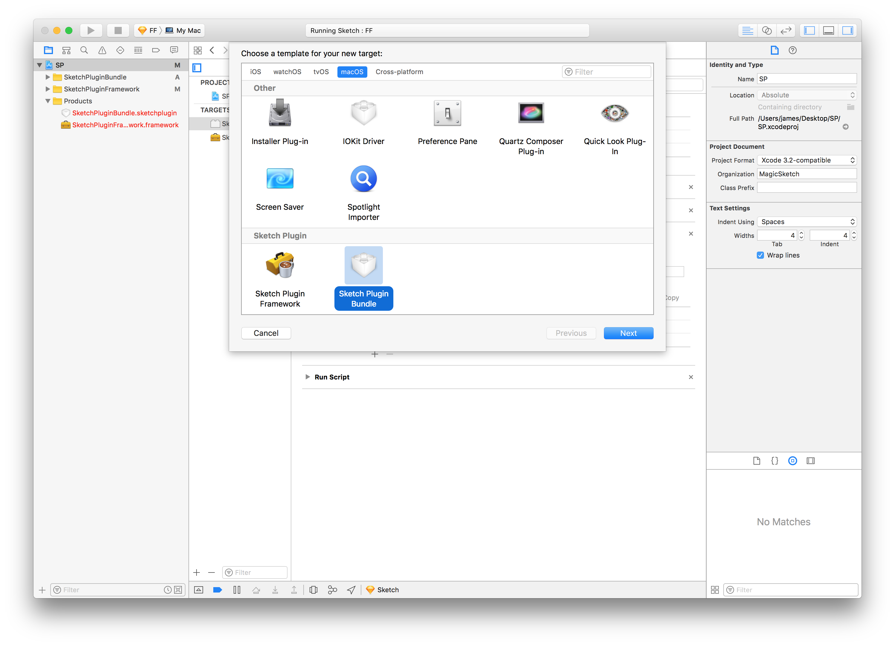
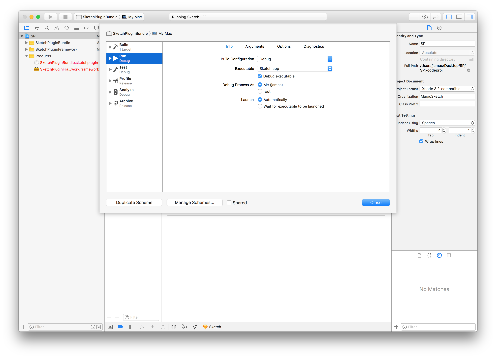
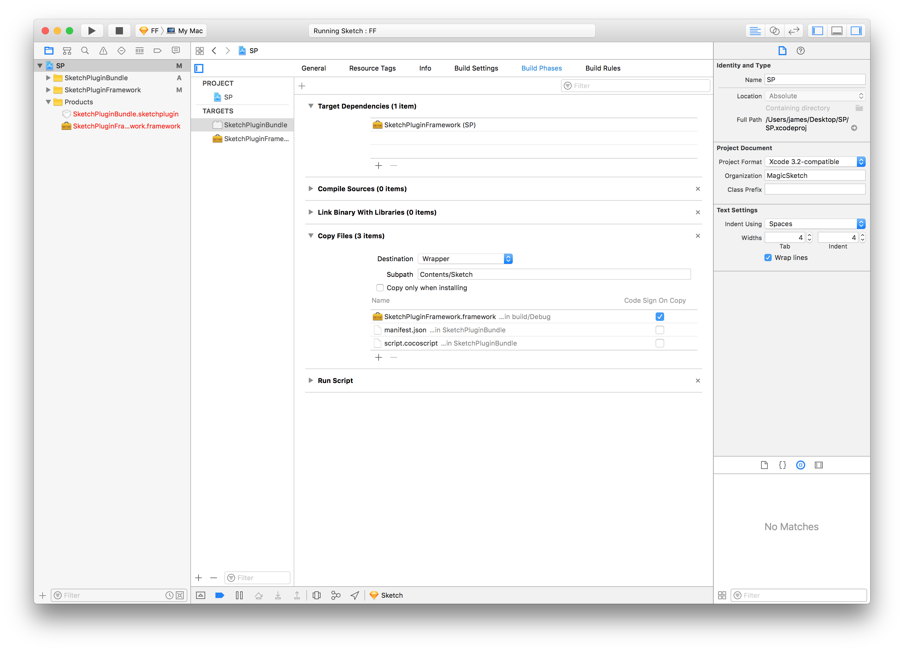
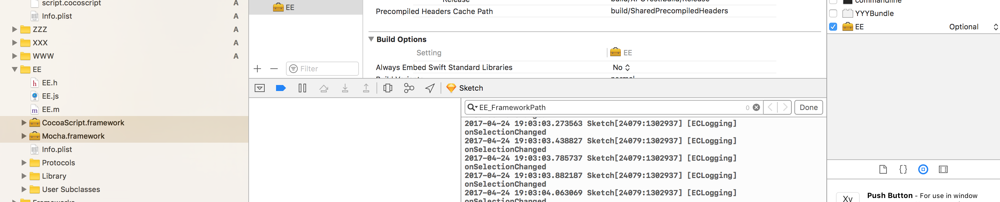

# Xcode Templates for Sketch Plugins

```
git clone git@github.com:MagicSketch/XcodeTemplate-SketchPlugin.git /Library/Developer/Xcode/Templates/Sketch\ Plugin
```

## Read our Introductory Blog Post

https://blog.magicsketch.io/sketch-plugin-xcode-template-c8236a6f7fff

## Available Templates

- Sketch Plugin Bundle (generates a .sketchplugin)
- Sketch Plugin Framework (generates a .framework)
- Sketch Panel UI Framework (generates a .framework for UI purpose)



### Sketch Plugin Bundle (.sketchplugin)

This will generate necessary files that you needed for your first Sketch plugin that will build with Xcode. You should almost always start with the when creating a new Xcode project.

Make sure you set the executable in the scheme.



## Sketch Plugin Framework (.framework)

This will generate a .framework ready for you to integrate in your .sketchplugin

After you create this target, go back select your bundle, and configure the Target Dependancy and the Copy File phase.



## Sketch Panel UI Framework

This will generate a .framework ready for you to write your own inspector panel UI in Sketch.

Make sure you'll have to set the target dependancy and copy files like usual framework procedures, and also manuall set CocoaScript.framework and Mocha.framework to Optional in Target Membership



